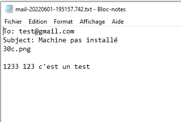

# Sciences-U - B3 IW - PHP7-8 MVC from scratch
___
### Système d'upload de fichiers et système de mailing
___
Nous avons choisis de mettre en place un système simple pour upload des fichiers
et un système de mailing.
___
### Entité User
Nous avons repris l'entité User avec les variables déjà existantes pour ajouter
les notres tel que imgProfile.
___
### Services
Nous avons créer un dossier Services où se situerons les fichiers dont nous avons besoin.

<u>**_UploadFiles.php_**</u>

Ce fichier contient
* Le constructeur où l'on va initialiser
  les valeurs récupérées dans le fichier _IndexController.php_ grâce aux méthodes _setImgName_ et _setImgPath_.
* Les différents Getters et Setters qui vont nous permettre de récupérer et insérer les nouvelles valeurs.
* La fonction upload qui va nous permettre d'upload l'image choisie vers un dossier _img_ se trouvant dans le dossier public.

<u>**_Email.php_**</u>

Ce fichier contient
* Le constructeur où l'on va initialiser les valeurs récupérées
* La fonction sendEmail avec la fonction _mail_ de PHP et les différents paramètres nécessaires à l'envoi d'un mail qui seront récupérées au préalable par les différents Getters et Setters

Grâce à l'intercepteur de mail de Laragon nous avons pu tester cette fonction, on reçoit bien le dernier mail envoyé

<u>**_IndexController.php_**</u>

Nous avons réutiliser ce fichier pour créer une nouvelle méthode __addAvatar__ qui nous permet de créer un nouvel utilisateur puis récupérer ses différentes informations grâce au formulaire et la méthode __$_POST__ dans le template twig __contact.html.twig__ telles que :
* Nom
* Prénom
* Mot de passe
* Email
* Date de naissance
* Nom de l'image

Grâce à la méthode __contact__, on va afficher le template twig contact avec le formulaire où l'on pourra rentrer ses informations (*_qui seront stockées dans les différentes variables_*) et choisir l'image à upload (*_qui sera stockée dans $_FILES puis triée dans le constructeur d'UploadFiles__* ).

Une fois que le bouton "*Enregistrer*" est cliqué, nous allons vérifier si les champs sont remplis ou non. Si oui nous avons toutes les données nécessaires et elles seront envoyées à la base de données où elle seront stockées puis on affiche la page *reussi.html.twig* pour informer l'utilisateur que ses données ont bien étés sauvegardée, si non on renvoie sur la page du formulaire pour le remplir une nouvelle fois.

Dans le cas où le if est égal à true nous avons 
* Ce résultat sur la page web

* Ce résultat en base de données 

La route qui nous permets d'accéder au template twig est "/contact" avec la méthode POST.

___
### Template twig
<u>**_contact.html.twig_**</u>

Ce fichier est notre template, nous l'avons donc réutiliser pour ajouter le formulaire avec en action "_/addAvatar_" pour qu'au clic sur le bouton Enregistrer on envoie les informations remplies par l'utilisateur.

Le form ressemble donc à ceci

<u>**_mail.html.twig_**</u>

Ce fichier est la vue qui nous sert de forulaire pour envoyer un email. Il contient un champ Email, Sujet et Message.

Créateur : Wyvin Stryus, Schwaller Nadia, Chaudhry Sofia, Salvi Coline.
