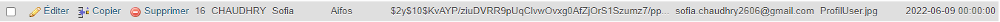

# Sciences-U - B3 IW - PHP7-8 MVC from scratch
___
### Système d'upload de fichiers et système de mailing
___
Nous avons choisis de mettre en place un système simple pour upload des fichiers
et un système de mailing.
___
### Entité User
Nous avons repris l'entité User avec les variables déjà existantes pour ajouter
les notres tel que imgProfile.
___
### Services
Nous avons créer un dossier Services où se situerons les fichiers dont nous avons besoin pour l'envoi des mails.

<u>**_UploadFiles.php_**</u>

Ce fichier contient
* Le constructeur où l'on va initialiser
  les valeurs récupérées dans le fichier ``IndexController.php`` grâce aux méthodes ``setImgName`` et ``setImgPath``.
* Les différents Getters et Setters qui vont nous permettre de récupérer et insérer les nouvelles valeurs.
* La fonction ``upload`` qui va nous permettre d'upload l'image choisie vers un dossier _img_ se trouvant dans le dossier public.
* La fonction ``verifyExtension`` qui va nous permettre de vérifier que le fichier upload correspond bien aux extensions que l'on propose grâce au paramètre passé en paramètre puis on retourne ``true`` si l'extension est valide sinon ``false`` et on va également passer le nom tout en minuscule.

<u>**_Email.php_**</u>

Ce fichier contient
* Le constructeur où l'on va initialiser les valeurs récupérées
* La fonction ``sendEmail`` avec la fonction ``mail`` de PHP et les différents paramètres nécessaires à l'envoi d'un mail qui seront récupérées au préalable par les différents Getters et Setters

Grâce à l'intercepteur de mail de Laragon nous avons pu tester cette fonction, on reçoit bien le dernier mail envoyé, malheureusement l'affichage n'est pas possible et les mails n'arrivent pas à destination car ça peut vite devenir compliqué avec tout les services de mail qui existent

<u>**_IndexController.php_**</u>

Nous avons réutiliser ce fichier pour créer une nouvelle méthode `addAvatar` qui nous permet de créer un nouvel utilisateur en récupérant les différentes informations grâce au formulaire et la méthode `$_POST` dans le template twig `contact.html.twig`.

Avant d'enregistrer les informations dans la BDD on appelle la fonction `verifyExtension`pour vérifier que l'extension du fichier upload correspond bien aux notre.

Les informations que l'on récupère sont les suivantes:
* Nom
* Prénom
* Mot de passe
* Email
* Date de naissance
* L'image qui a été upload

Nous avons également une méthode `passwordHash` qui permet de hacher les mots de passes passé en paramètre pour éviter qu'ils soient écrit en dur dans la base de données.

Grâce à la méthode __contact__, on va afficher le template twig contact avec le formulaire où l'on pourra rentrer ses informations (*_qui seront stockées dans les différentes variables_*) et choisir l'image à upload (*_qui sera stockée dans $_FILES puis triée dans le constructeur d'UploadFiles__* ).

Une fois que le bouton "*Enregistrer*" est cliqué, nous allons vérifier si les champs sont remplis ou non. Si oui nous avons toutes les données nécessaires et nous allons vérifier que l'extension du fichier correspond aux extensions que nous proposons. Si tout correspond les informations seront envoyées à la base de données où elle seront stockées puis on affiche la page *reussi.html.twig* pour informer l'utilisateur que ses données ont bien étés sauvegardée, si non grâce au `require` de HTML on reste sur la même page jusqu'à ce que le formulaire soit correct.

Dans le cas où le if est égal à true nous avons 
* Ce résultat sur la page web

* Ce résultat en base de données 

La route qui nous permets d'accéder au template twig est "/contact" avec la méthode POST et grâce à la méthode __contact__.

<u>**_EmailController.php_**</u>

Nous avons créer ce fichier pour pouvoir récupérer les données du formulaire de l'email grâce à la fonction __sendEmail__ et la méthode __POST__.

On ajoute ensuite ces informations dans une variable `$header` qui nous permet de construire l'en-tête du mail avec un `Content-Type: multipart/mixed`pour ajouter des fichiers joints au mail.

On construit ensuite le message du mail et on l'encode, si un fichier a été ajouté et qu'il correspond aux extensions demandées on récupère ses informations et on ouvre le fichier pour le lire et le split pour ne pas qu'il soit tropgrand.

On va ensuite ajouter la pièce jointe au mail  grâce à la partie `Content-Type` et `Content-Disposition: attachment`.

Si tout est correct et que notre mail n'est pas vide on envoie le mail et nous renvoie vers une page pour nous dire que tout est bon et que le mail a été envoyé.

La route qui nous permets d'accéder au template twig est "/email" grâce à la fonction __email__.

___
### Template twig
<u>**_contact.html.twig_**</u>

Ce fichier est notre template, nous l'avons donc réutiliser pour ajouter le formulaire avec en action "_/addAvatar_" pour qu'au clic sur le bouton Enregistrer on envoie les informations remplies par l'utilisateur.

Le form ressemble donc à ceci

<u>**_mail.html.twig_**</u>

Ce fichier est la vue qui nous sert de forulaire pour envoyer un email. Il contient un champ Expéditeur, destinaire , Sujet et Message.

Le formulaire pour l'envoie du mail ressemble à ceci

Dans les deux formulaires nous avons obligé les personnes à remplir les gens champs grâce au `require` et avoir un vrai format de mail grâce à un pattern :

`^[\w]{1,}[\w.+-]{0,}@[\w-]{1,}([.][a-zA-Z]{1,}|[.][\w-]{1,}[.][a-zA-Z]{1,})$`

Ce pattern nous permet d'accepter toutes les adresses email avec au moins une lettre avant '@' et au moins un caractère avant et après le point.

Le bouton pour les deux formulaires contient également une condition, pour le contact la personne ne peut upload que des images png, jpeg ou jpg, le mail peut en plus ajouter les fichiers pdf.

Fait par 
* Wyvin Stryus
* Chaudhry Sofia
* Schwaller Nadia
* Salvi Coline.
